# DraftGuard — System Flow

One continuous top-to-bottom flowchart, following the current analysis and review behavior and the [PRD](PRD.md). Google Cloud Run hosts the frontend and backend; Supabase provides the planned database and private document storage. Dashed boxes mark deployment requirements, while dashed arrows show optional or failure paths.

```mermaid
flowchart TD
    OPEN["Open DraftGuard"]
    HOST["Google Cloud Run serves the web app<br/>React · TypeScript · Vite · CSS"]
    SESSION["Create a demo-session capability<br/>FastAPI checks private task and file ownership"]
    INBOX["Open Inbox / Overview"]
    ENTRY{"Start from a sample<br/>or a new task?"}
    SAMPLE["View a read-only sample<br/>Create a working copy to make changes"]
    CUSTOM["Create a task<br/>Enter email subject, sender and body"]
    SOURCES["Add SI and draft-BL attachments<br/>or use the copied source versions"]
    STORAGE["Preserve original files in private Supabase Storage<br/>Save task, version and hash metadata in PostgreSQL"]
    RUN["Request analysis through FastAPI<br/>Bind run ID to the expected revision and sources"]

    OPEN --> HOST
    HOST --> SESSION
    SESSION --> INBOX
    INBOX --> ENTRY
    ENTRY -->|"Sample"| SAMPLE
    ENTRY -->|"New task"| CUSTOM
    SAMPLE --> SOURCES
    CUSTOM --> SOURCES
    SOURCES --> STORAGE
    STORAGE --> RUN

    CLASSIFY["Classify the email using rules"]
    CONCLUSIVE{"Classification<br/>conclusive?"}
    AI_CLASS["Use Gemini for ambiguous classification"]
    CATEGORY{"BL_COMPARISON?"}
    OTHER["Save the email category<br/>No seven-field comparison"]
    ATTACHMENTS{"Attachments available?"}
    VALIDATE["Validate each source independently<br/>Check content type, size and processing limits"]
    FORMAT{"Document format?"}
    TXT["TXT<br/>Decode text and preserve line references"]
    PDF["PDF · pypdf<br/>Extract text with page references"]
    DOCX["DOCX · python-docx<br/>Extract paragraphs and table cells"]
    XLSX["XLSX · openpyxl<br/>Extract sheets and cell references"]

    RUN --> CLASSIFY
    CLASSIFY --> CONCLUSIVE
    CONCLUSIVE -->|"Yes"| CATEGORY
    CONCLUSIVE -->|"No"| AI_CLASS
    AI_CLASS --> CATEGORY
    CATEGORY -->|"No"| OTHER
    CATEGORY -->|"Yes"| ATTACHMENTS
    ATTACHMENTS -->|"Yes"| VALIDATE
    ATTACHMENTS -->|"No"| COMPARE
    VALIDATE --> FORMAT
    FORMAT -->|"TXT"| TXT
    FORMAT -->|"PDF"| PDF
    FORMAT -->|"DOCX"| DOCX
    FORMAT -->|"XLSX"| XLSX

    CONTENT{"Source content?"}
    RULES["Extract fields with deterministic rules"]
    FALLBACK{"Eligible fields need<br/>semantic fallback?"}
    AI_TEXT["Gemini extracts from this source only<br/>Validate response and verify source quotes"]
    AI_PDF["Send the actual PDF to Gemini<br/>Analyze each document separately"]
    CANDIDATES["Keep visual values as unconfirmed candidates<br/>Retain page references for human review"]
    SOURCE_ISSUES["Preserve unreadable or rejected-source issues<br/>Require review or a replacement document"]
    VALUES["Retain original and normalized values<br/>Keep evidence, missing states and review requirements"]
    COMPARE["Validate document roles and the SI / BL pair<br/>Compare all seven fields deterministically"]
    FINDINGS["Produce per-field findings<br/>MATCH · MISMATCH · NEEDS_REVIEW · NOT_CHECKED"]
    SAVE["Save the machine result and audit trail<br/>Retain exact source versions and revision differences"]
    CURRENT{"Run still belongs to<br/>the current task revision?"}
    HISTORY["Keep the result as history<br/>Do not replace the current result"]

    TXT --> CONTENT
    PDF --> CONTENT
    DOCX --> CONTENT
    XLSX --> CONTENT
    CONTENT -->|"Readable text"| RULES
    CONTENT -->|"PDF without usable text"| AI_PDF
    CONTENT -->|"Unreadable or rejected"| SOURCE_ISSUES
    RULES --> FALLBACK
    FALLBACK -->|"No"| VALUES
    FALLBACK -->|"Yes"| AI_TEXT
    AI_TEXT --> VALUES
    AI_PDF --> CANDIDATES
    CANDIDATES --> VALUES
    SOURCE_ISSUES --> COMPARE
    VALUES --> COMPARE
    COMPARE --> FINDINGS
    FINDINGS --> SAVE
    SAVE --> CURRENT
    CURRENT -->|"No"| HISTORY
    CURRENT -->|"Yes"| REVIEW

    REVIEW["Display the comparison and source evidence<br/>Keep discrepancies and review requirements visible"]
    ELIGIBLE{"Both sources present, seven evidenced matches,<br/>and no pending review or completion blockers?"}
    ACTION{"Required next action?"}
    CORRECT["Confirm a visual candidate<br/>or correct extraction using source evidence"]
    SUPPLY["Supply missing information with provenance<br/>Keep it distinct from extracted source values"]
    OVERLAY["Append the review action<br/>Preserve the original machine output"]
    RECHECK["Apply the review overlay<br/>Recompute findings and completion blockers"]
    REPLACE["Upload a missing or revised source<br/>or explicitly select the SI / BL pair"]
    REVISION["Advance the task revision<br/>Invalidate the old completion and amendment draft"]
    RERUN["Analyze the current revision again<br/>Recheck all seven fields"]
    ACK["Reviewer acknowledges the exact run and revision"]
    COMPLETE["CHECK_COMPLETE<br/>Persist the completion acknowledgment"]
    REPORT["Preview report and Print / Save PDF<br/>Include sources, findings and review history"]

    REVIEW --> ELIGIBLE
    ELIGIBLE -->|"Yes"| ACK
    ACK --> COMPLETE
    COMPLETE --> REPORT
    ELIGIBLE -->|"No"| ACTION
    ACTION -->|"Candidate or extraction issue"| CORRECT
    ACTION -->|"Missing business information"| SUPPLY
    ACTION -->|"Missing, wrong or revised source; unclear pair"| REPLACE
    CORRECT --> OVERLAY
    SUPPLY --> OVERLAY
    OVERLAY --> RECHECK
    RECHECK --> REVIEW
    REPLACE --> REVISION
    REVISION --> RERUN
    RERUN --> RUN
    REVIEW -.->|"Report before completion"| REPORT
    HISTORY -->|"Historical report"| REPORT

    AMENDMENT["Build a locked, source-backed amendment issue list"]
    WORDING["Gemini polishes subject, opening and closing<br/>or reviewer selects standard wording"]
    COPY["Edit and save permitted wording<br/>Copy the email for manual sending"]
    REVIEW -.->|"Optional: actionable current unfinished comparison"| AMENDMENT
    AMENDMENT --> WORDING
    WORDING --> COPY

    FAILURE["Show an explicit processing failure<br/>Retain any previous successful result<br/>Offer retry when appropriate"]
    AI_CLASS -.->|"Provider failure"| FAILURE
    AI_TEXT -.->|"Provider or response-schema failure"| FAILURE
    AI_PDF -.->|"Provider failure"| FAILURE
    VALIDATE -.->|"Worker / read failure or timeout"| FAILURE
    SAVE -.->|"Save failure"| FAILURE

    classDef planned stroke-dasharray:5 5;
    class HOST,SESSION,STORAGE planned;
```

**Seven fields:** shipper, consignee, notify party, port of loading, port of discharge, container count, and gross weight in kilograms.

**Flow rules:**

- Supabase persistence, Cloud Run hosting, demo-session ownership, and scoped direct uploads are deployment requirements. The diagram does not claim they are already connected in the development API.
- Missing SI/BL sources produce `WAITING_DOCUMENT`. Unverified text quotes and visual candidates remain review requirements; values are never copied from one source to fill the other.
- Review and completion require the current run and revision. Stale writes return a conflict; externally supplied information blocks completion until resolved through source evidence. Historical and completed runs are read-only for review actions.
- Amendment drafts require a successful, current, unfinished comparison with actionable findings. Gemini receives only the original subject and issue counts/types; it cannot alter the locked issue list. The application never sends email.
- Reports can be generated before completion and must identify historical results. `CHECK_COMPLETE` acknowledges the seven-field scope, not legal or cargo-release approval.

Sources: [PRD](PRD.md), [UI behavior](UI.md), [mailbox workflow](../backend/app/documents/workflow.py), [run service](../backend/app/dev_extraction/service.py), [comparison](../backend/app/documents/analysis.py), and [review/revision handling](../backend/app/task_store.py).
